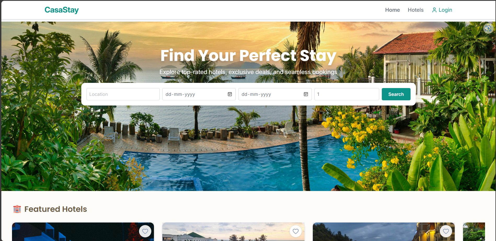

# 🏨 CasaStay – Hotel Booking System (Frontend)

Welcome to the **CasaStay Hotel Booking System Frontend** 🎉 – a modern web application built with **React + Vite + TailwindCSS** to deliver a seamless hotel booking experience with rich UI/UX enhancements.

---

## ✨ Features (User-Facing)

- 🔎 **Search & Filtering** – Find hotels by location, price, amenities, and room type.  
- 🏨 **Hotel & Room Details** – Images, descriptions, amenities, bed type, views, capacity.  
- 📅 **Availability Calendar** – Check room availability instantly for selected dates.  
- 🛏️ **Room Booking Flow** – Select dates, guests, special requests, and confirm booking.  
- 💳 **Stripe Payment Integration** – Secure card payments & digital wallets.  
- 🎁 **Special Offers** – Apply promo codes & discounts during checkout.  
- 🪙 **Loyalty Coins** – Earn coins for bookings above ₹1000.
- ☑️ **ID verification** -  Handled ID verification (manual/AI/ocr).
- 💬 **Reviews & Ratings** – Only verified guests can submit reviews after stays.  
- 👤 **User Profiles** – Manage personal info, view booking history, and saved favorites.  
- 📧 **Notifications** – Booking confirmations & reminders.  
- 📱 **Responsive UI** – Mobile-first, fully optimized with TailwindCSS.  

---

## 🛠️ Tech Stack

- ⚛️ **React 18 + Vite** – Fast and modern React setup.  
- 🎨 **TailwindCSS** – Utility-first responsive design.  
- 🔐 **React Router** – Routing and protected routes.  
- 🍞 **React Hot Toast** – Notifications (smart positioning so it doesn’t overlap navbar).  
- 📦 **Axios** – API communication.  
- 🗂 **React Context API** – State management (no Redux needed).  

---

## 🚀 Enhancements / Add-ons

- 🌈 Gradient layouts, modern modals with outside click-to-close.  
- 📊 Booking success page redesigned with summaries & loyalty rewards.  
- 🛡️ Conditional rendering of review forms (only verified users after paid stay).  
- 🧭 Admin panel excluded from user navbar after logout.  
- 📱 Mobile bottom navigation for user & admin flows.  
- 🖼️ Placeholder “No offers / No reviews” messages to avoid user confusion.  

---

## ⚡ Getting Started

```bash
# clone repo
git clone https://github.com/Aarthi1720/frontend
cd casastay-frontend

# install dependencies
npm install

# run locally
npm run dev

# build for production
npm run build
```

---

## 🔗  Environment Variables

Create a `.env` file with:

```env
VITE_API_BASE_URL=http://localhost:5000/api
VITE_STATIC_URL=http://localhost:5000/
VITE_STRIPE_PUBLISHABLE_KEY=your_stripe_publishable_key

```

## 📸 Screenshots



---

## 🚀 Live Demo & Test Accounts

**Frontend**: https://hotel-booking-frontend-beige.vercel.app/
**Backend API** (read-only docs): https://hotel-booking-backend-ruqd.onrender.com/

**Admin (demo)**
- Email: sweetaarthi1705@gmail.com
- Password: 123456

**User (demo)**
- Email: sweetaarthi1720@gmail.com
- Password: 987654

> These are demo accounts for evaluation on the hosted site only.

---
